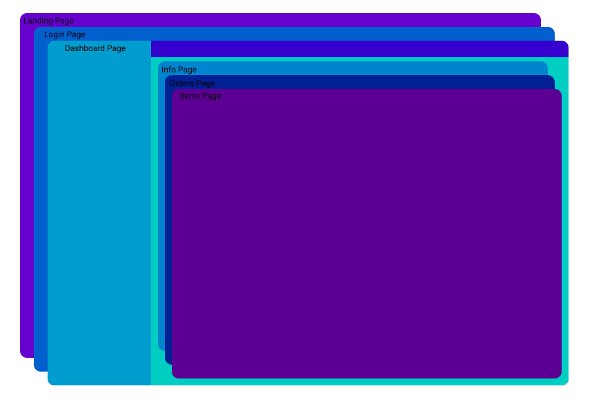

# Qlevar Router (QR)

[](https://pub.dev/packages/qlevar_router)
[](https://pub.dev/packages/qlevar_router)
[](https://pub.dev/packages/qlevar_router)

- [Qlevar Router (QR)](#qlevar-router-qr)
  - [Demo](#demo)
  - [Nested Navigation](#nested-navigation)

Qlevar router is flutter package to help you with managing your project routing, navigation, deep linking, route params, etc ...
With Navigator 2.0 Manage your project routes and create nested routes. Change only one widget on your page when navigating to the new route. Navigate without context from anywhere to anywhere.

```dart
// Define your routes
class AppRoutes {
  static String homePage = 'Home Page';
  static String userPage = 'User Page';
  final routes = [
    QRoute(name: homePage, path: '/', builder: () => HomePage()),   
    QRoute(
        name: userPage,
        path: '/user/:userId',
        builder: () => HomePage(),
        children: [
          QRoute(name: homePage, path: '/settings', builder: () => SettingsPage()),
          QRoute(name: homePage, path: '/profile', builder: () => ProfilePage()),
        ]),
    QRoute(path: '/products/:category(\w)', builder: () => ProductCategory()),
    QRoute(path: '/products/:id((^[0-9]\$))', builder: () => ProductDetails()),
  ];
}

// Create your app
class MyApp extends StatelessWidget {
  @override
  Widget build(BuildContext context) => MaterialApp.router(
      routeInformationParser: QRouteInformationParser(),
      routerDelegate: QRouterDelegate(AppRoutes().routes));
}

// from anywhere in your code navigate to new page with
QR.toName(AppRoutes.userPage, param:{'userId':2});
// or
QR.to('/user/2');

QR.to('/user/6/profile')  // Here the Stack will be HomePage -> ProfilePage()
QR.to('products/456')     // Will call ProductDetails page
QR.to('products/garden')  // Will call ProductCategory page
QR.back()                 // Go back to the last page(in this case 'products/456')
QR.currentPath            // will show the current path 
```

you want to work with the basic functions from the navigator just set which navigator to use with `QR.activeNavigatorName` and then call it and use it

```dart
  QR.navigator.canPop;
  QR.navigator.currentRoute //Get the current route for this navigator

  QR.navigator.pushName(String name, {Map<String, dynamic>? params})
  QR.navigator.push(String path);

  QR.navigator.replaceAll(String path);
  QR.navigator.replaceAllWithName(String name, {Map<String, dynamic>? params});

  QR.navigator.replace(String path, String withPath);
  QR.navigator.removeLast();
```

or just call the navigator `QR.navigatorOf('Dashboard')`

Use this functions to see your navigators and Stack history and active pages in your project for better understanding on where you are in your project and how to order you pages.

```dart
QR.getActiveTree() // Will show you a dialog contains the tree of the active navigator and pages
QR.history.debug() // will show the history stack for your current page.
```

## Demo

<a href="https://routerexample.qlevar.de/" target="_blank">Show Demo</a>

You can find the demo code in the [example](https://github.com/SchabanBo/qlevar_router/tree/master/example/lib) project

## Nested Navigation

Lets say we have want to develop a website with this structure



The Routes definitions for this website will be

```dart
class AppRoutes {
  static String landingPage = 'Landing Page';
  static String loginPage = 'Login Page';
  static String dashboardPage = 'Dashboard Page';
  static String infoPage = 'Info Page';
  static String ordersPage = 'Orders Page';
  static String itemsPage = 'Items Page';

  final routes = [
    QRoute(name: landingPage, path: '/', builder: () => LandingPage()),
    QRoute(name: loginPage, path: '/login', builder: () => LoginPage()),
    QRoute.withChild(
        name: dashboardPage,
        path: '/dashboard',
        builderChild: (c) => DashboardPage(c),
        initRoute: '/info',
        middleware: [
          // Add middleware with redirection guard to make sure
          // that only the authorized users can enter this page or it children
          QMiddlewareBuilder(redirectGuardFunc: () async {
            return await AuthService().isLogged ? null : '/login';
          })
        ],
        children: [
          QRoute(name: infoPage, path: '/info', builder: () => InfoPage()),
          QRoute(name: ordersPage, path: '/orders', builder: () => OrdersPage()),
          QRoute(name: itemsPage, path: '/items', builder: () => ItemsPage()),
        ]),
  ];
}

// The dashboard page can look like this
class Dashboard extends StatelessWidget {
  final QRouter child;
  Dashboard(this.child);
  @override
  Widget build(BuildContext context) {
    return Scaffold(
      body: Row(
        children: [
          Sidebar(),
          Expanded(child: child),
        ],
      ),
    );
  }
}

```

And now from anywhere from your code (Without any need to the BuildContext) you can call `QR.toName(AppRoutes.infoPage)` and if the user logged in, then the info page in the dashboard will be opened
